# 3.1.5 Entity Relationship Diagram

```mermaid
erDiagram
    %% ── USER & PROFILES ──────────────────────────────
    User ||--o| Startup              : "has profile"
    User ||--o| Investor             : "has profile"
    User ||--o| Advisor              : "has profile"

    %% ── USER ACTIVITIES ──────────────────────────────
    User ||--o{ Booking              : "books (Customer)"
    User ||--o{ Transaction          : "has"
    User ||--o{ Subscription         : "subscribes"
    User ||--o{ ActionLog            : "generates"
    User ||--o{ ChatMessage          : "sends"
    User ||--o{ Review               : "writes"
    User ||--o{ Notification         : "receives"
    User ||--o{ RefreshToken         : "has"
    User ||--o{ UserReport           : "reports"
    User ||--o{ UserReport           : "is reported"
    User }o--o{ Startup              : "follows (StartupFollower)"

    %% ── STARTUP ──────────────────────────────────────
    Startup ||--o{ Project           : "posts"
    Startup ||--o{ Document          : "uploads"
    Startup ||--o{ StartupAIAnalysis : "has AI eval"
    Startup ||--o{ InvestorAIAnalysis: "matched by AI"
    Startup ||--o{ ConnectionRequest : "receives"
    Startup ||--o{ Deal              : "has"

    %% ── INVESTOR ─────────────────────────────────────
    Investor ||--o{ ConnectionRequest : "sends"
    Investor ||--o{ Deal              : "makes"
    Investor ||--o{ InvestorAIAnalysis: "has AI match"

    %% ── ADVISOR ──────────────────────────────────────
    Advisor ||--o| Wallet            : "owns"
    Advisor ||--o{ Booking           : "provides"
    Advisor ||--o{ Review            : "receives"

    %% ── INVESTMENT FLOW ──────────────────────────────
    ConnectionRequest ||--o{ PostPr  : "generates"
    Deal              ||--o{ NFTRecord : "mints"

    %% ── DOCUMENT & BLOCKCHAIN ────────────────────────
    Document ||--o{ BlockchainProof  : "verified by"

    %% ── CONSULTING ───────────────────────────────────
    Booking ||--o{ ChatSession       : "has"
    Booking ||--o{ ConsultingReport  : "has"
    ChatSession ||--o{ ChatMessage   : "contains"

    %% ── FINANCE ──────────────────────────────────────
    Package ||--o{ Subscription      : "subscribed by"
    Wallet  ||--o{ WalletTransaction : "has"
    Wallet  ||--o{ WithdrawRequest   : "has"
```

---

## Entities Description

| # | Entity | Description |
|---|--------|-------------|
| 1 | **User** | The central account entity of the AISEP platform, built on top of ASP.NET Core Identity. Each User account holds authentication credentials (email, hashed password, phone number) inherited from IdentityUser, along with platform-specific attributes such as Role (Startup, Investor, Advisor, Admin), Status (Active, Banned, Pending), email verification flag, and date of birth. A single User account can be associated with exactly one profile type — either a Startup, Investor, or Advisor — through a one-to-one relationship. Users also participate in bookings, subscriptions, transactions, notifications, and action logging throughout the system. |
| 2 | **Startup** | Represents the company profile of a startup registered on the AISEP platform. Each Startup is linked one-to-one with a User account and stores the core identity information of the company, including company name, logo, founder name, contact information, country/city, website, industry sector, and development stage (Idea, MVP, Growth, Scale). It also captures detailed business intelligence such as the problem statement, solution description, target customers, unique value proposition, market size, business model, revenue figures, key competitors, team members, key skills, and team experience. A Startup can create multiple Projects (pitch posts), upload Documents, receive ConnectionRequests from Investors, and enter into Deals. |
| 3 | **Investor** | Represents the profile of an investor registered on the AISEP platform. Each Investor is linked one-to-one with a User account and stores their investment identity and preferences, including organization name, investment taste (description of what they look for), wallet address, total investment amount, investment date, risk tolerance level (Low, Medium, High), preferred investment region, focus industry, preferred startup stage (Idea, MVP, Growth, Scale), and a summary of previous investments. Investors can send ConnectionRequests to Startups, enter into Deals, and receive AI-generated match analyses against Startup profiles. |
| 4 | **Advisor** | Represents the profile of a consulting expert or mentor available for booking on the AISEP platform. Each Advisor is linked one-to-one with a User account and stores professional information including bio, areas of expertise, certifications, previous experience, average rating score, languages spoken, and location. Advisors manage their own earnings via a linked Wallet (one-to-one). They can receive Bookings from Users, conduct sessions through ChatSessions, generate ConsultingReports, and accumulate Reviews from clients. |
| 5 | **Project** | Represents a pitch post or investment opportunity listing created by a Startup to attract potential investors on the AISEP platform. Each Project belongs to one Startup and contains a project name, short description, full detailed description, and a publication status (e.g., Active, Closed, Draft). Projects serve as the public-facing content that Investors browse when looking for investment opportunities. AI analyses (both StartupAIAnalysis and InvestorAIAnalysis) are associated with the Startup rather than the specific project post. |
| 6 | **Document** | Represents a file or document uploaded by a Startup to support its pitch or verify its claims. Documents are stored at the Startup level (not per Project), allowing the same set of documents to apply across multiple pitches. Each document records the document type (PitchDeck, FinancialReport, LegalDocument, etc.), original file name, file URL (hosted on Cloudinary), a SHA-256 file hash for integrity verification, a blockchain transaction hash if IP-protected, an IP protection flag, and a verification timestamp. Documents can be anchored to the blockchain for intellectual property protection, with verification evidence stored in linked BlockchainProof records. |
| 7 | **StartupAIAnalysis** | Stores the result of an AI-powered evaluation performed on a Startup's profile. The analysis is triggered when a Startup submits its information for assessment. It produces a PotentialScore (integer, 0–100) representing the startup's overall investment potential, a ChaosScore (integer, 0–100) representing risk or instability factors, and a detailed AnalysisJson string containing the full structured AI output including strengths, weaknesses, and recommendations. The analysis is linked directly to the Startup entity and timestamped at creation. |
| 8 | **InvestorAIAnalysis** | Stores the result of an AI-generated compatibility analysis between a specific Investor and a specific Startup. This analysis evaluates how well the investor's preferences (industry focus, stage preference, risk tolerance, investment region) align with the startup's profile and current stage. The result is stored as a structured AnalysisJson string, which may include a compatibility score, key matching factors, potential concerns, and a recommendation. The entity is linked to both the Investor and the Startup, and is timestamped at creation. |
| 9 | **ConnectionRequest** | Represents a formal expression of interest sent by an Investor to a Startup. When an Investor finds a Startup's pitch compelling, they initiate a ConnectionRequest that includes a personalized message and optionally a reason for interest. The request goes through a lifecycle tracked by a status field (Pending, Accepted, Rejected). Additional fields capture the response date, response message, and whether the request has been read by the Startup. Accepted ConnectionRequests can evolve into PR Posts (PostPr) visible to the community, and ultimately lead to Deal negotiations. |
| 10 | **PostPr** | Represents a public relations announcement or deal disclosure post generated from a successfully accepted and mutually approved ConnectionRequest. Once both the Startup and the Investor confirm their agreement to publish, the post becomes visible on the platform. Each PostPr stores a title, content body, individual approval flags for both Startup and Investor, and an optional published timestamp. This entity enables transparency in the ecosystem by publicly acknowledging successful investor-startup connections. |
| 11 | **Deal** | Represents a finalized or in-progress investment agreement between an Investor and a Startup. A Deal is created after a successful ConnectionRequest negotiation and captures the financial terms of the agreement, including the investment amount (decimal), equity percentage offered, payment method (e.g., bank transfer, crypto), and a blockchain transaction hash for on-chain payment verification. The Deal tracks confirmation status from both parties (StartupConfirmed, InvestorConfirmed) and an overall completion status with a completion date. Upon completion, the Deal can trigger the minting of one or more NFTRecords as digital proof of the investment agreement. |
| 12 | **NFTRecord** | Represents a Non-Fungible Token (NFT) minted on the blockchain as a tamper-proof digital certificate for a completed Deal. Each NFTRecord stores the unique token ID on the blockchain, the minting transaction hash, the current owner's wallet address, the minting timestamp, a validity status (Valid, Revoked, Transferred), a transferability flag, and the previous owner's wallet address (if ownership was transferred). NFTRecords provide immutable proof of investment agreements and enable potential secondary market transfers between parties. |
| 13 | **Booking** | Represents a scheduled consulting session between a User (acting as a customer/client) and an Advisor on the AISEP platform. A Booking captures the Advisor and Customer involved, the session start and end time, the price charged for the session, and the current booking status (Pending, Confirmed, Completed, Cancelled). Once a Booking is confirmed, it serves as the anchor for a ChatSession (real-time communication) and a ConsultingReport (formal post-session documentation). |
| 14 | **ChatSession** | Represents a real-time messaging room opened within the context of a confirmed Booking between an Advisor and a User. Each ChatSession is associated with exactly one Booking and tracks whether the session is currently open or closed, along with the session start time and optional end time. During an open ChatSession, both participants can exchange multiple ChatMessages, enabling live communication throughout the consulting engagement. |
| 15 | **ChatMessage** | Represents an individual message exchanged within a ChatSession. Each ChatMessage records the session it belongs to, the sender (a User), the text content of the message, and the exact timestamp when it was sent. This entity enables a full conversation history to be preserved for each consulting session, which can later be referenced in the ConsultingReport or reviewed by the parties involved. |
| 16 | **ConsultingReport** | Represents a formal post-session documentation record created by an Advisor upon completion of a Booking. The report captures the meeting title, physical or virtual location, scheduled meeting time, the stated purpose of the meeting, the main content discussed during the session, key decisions or action items agreed upon, and the report creation timestamp. ConsultingReports serve as official records of consulting engagements and can be referenced by Users for accountability and follow-up. |
| 17 | **Review** | Represents a rating and written feedback submitted by a User (Reviewer) for an Advisor after a completed consulting session. Each Review records the targeted Advisor, the reviewing User, a numerical rating score, an optional written review content, and the creation timestamp. Reviews contribute to the Advisor's overall reputation on the platform and help other Users make informed decisions when booking consulting sessions. |
| 18 | **Wallet** | Represents a digital wallet exclusively owned by an Advisor for managing their earnings and financial activity on the AISEP platform. Each Advisor has exactly one Wallet (one-to-one relationship). The Wallet stores the current balance (decimal), the currency type (e.g., VND, USD), and an active/inactive flag. All financial movements within the Wallet are tracked through linked WalletTransaction records, and fund withdrawal requests are managed through WithdrawRequest records. |
| 19 | **WalletTransaction** | Represents an individual financial movement recorded within an Advisor's Wallet. Each WalletTransaction captures the Wallet it belongs to, the transaction amount, the type of transaction (Deposit, Payment, Refund, Withdrawal), the processing status (Pending, Completed, Failed), and the creation timestamp. WalletTransactions maintain a complete and auditable financial history for each Advisor's earnings and expenditures on the platform. |
| 20 | **WithdrawRequest** | Represents a formal request submitted by an Advisor to withdraw funds from their Wallet to an external bank account or payment method. Each WithdrawRequest records the source Wallet, the requested withdrawal amount, the current processing status (Pending, Approved, Rejected), and the timestamp when the request was submitted. Withdrawal requests are reviewed by platform administrators before funds are transferred. |
| 21 | **Transaction** | Represents a platform-level financial transaction record associated with a User's activity on the AISEP platform. Unlike WalletTransactions (which are Advisor-specific), Transactions capture general financial events such as subscription payments, service fees, or other monetary activities. Each Transaction records the User involved, the transaction amount, the transaction type (enum), the processing status (enum), and the transaction date. |
| 22 | **Package** | Represents a subscription plan or service package offered by the AISEP platform to its Users. Each Package defines a package name, a description of included features and benefits, the subscription price (decimal), and the duration in days for which the subscription remains valid. Packages serve as the product catalog for the platform's monetization strategy, enabling Users to unlock premium features and services. |
| 23 | **Subscription** | Represents a User's active enrollment in a specific service Package on the AISEP platform. Each Subscription record links a User to a Package and tracks the subscription start date, expiration date, and current status (Active, Expired, Cancelled). A User may have multiple Subscription records over time (e.g., renewal history), but typically only one active subscription at any given moment. Subscriptions gate access to premium features for Startups and Investors. |
| 24 | **ActionLog** | Represents an audit trail entry automatically recorded whenever a User performs a significant action within the AISEP platform. Each ActionLog captures the User who performed the action, the type of action (e.g., "Create", "Update", "Delete", "Login"), the type of entity affected (e.g., "Project", "Deal", "Booking"), the ID of the specific affected entity, an optional human-readable description, and the exact timestamp of the action. ActionLogs are used by platform administrators for security auditing, debugging, and compliance monitoring. |
| 25 | **Notification** | Represents an in-application notification delivered to a specific User to inform them of relevant events or updates on the AISEP platform. Each Notification stores the recipient User, the notification message content, the read/unread status (enum: Unread, Read), and the creation timestamp. Notifications are generated automatically by the system in response to events such as receiving a ConnectionRequest, a Booking being confirmed, a Deal being updated, or a new Review being posted. |
| 26 | **BlockchainProof** | Represents a cryptographic verification record stored on the blockchain for a specific Document uploaded by a Startup. When a Document is flagged as IP-protected, the system computes a SHA-256 hash of the file and submits it to the Sepolia blockchain network. The resulting BlockchainProof stores the associated Document, the on-chain transaction hash, the timestamp of the blockchain submission, and the verification status (Pending, Verified, Failed). This mechanism provides immutable proof of document existence and ownership at a specific point in time. |
| 27 | **RefreshToken** | Represents a JWT refresh token issued to an authenticated User for maintaining and renewing login sessions without requiring re-entry of credentials. Each RefreshToken stores the associated User, the token string value (up to 500 characters), the expiry date, a revocation flag, the creation timestamp, the IP address from which the token was created, the revocation timestamp and IP (if revoked), and the replacement token string (if rotated). An index is maintained on the Token field for efficient lookup during token validation and rotation. |
| 28 | **StartupFollower** | Represents the many-to-many relationship between Users and Startups for the "follow" feature on the AISEP platform. The composite primary key consists of both UserId and StartupId, ensuring each User can follow a given Startup only once. Each record also stores the timestamp when the follow action occurred (FollowedAt). This entity enables Investors and other Users to subscribe to updates from specific Startups, supporting a social discovery layer within the investment ecosystem. |
| 29 | **UserReport** | Represents a formal misconduct report filed by one User (Reporter) against another User (ReportedUser) on the AISEP platform. Each UserReport captures the identity of both parties, a textual reason for the report, an optional evidence URL (e.g., a screenshot or document link), the current processing status (Pending, Resolved, Dismissed), and the report creation timestamp. Platform administrators review submitted reports and take appropriate action, such as issuing warnings, suspending accounts, or dismissing unfounded claims. |
