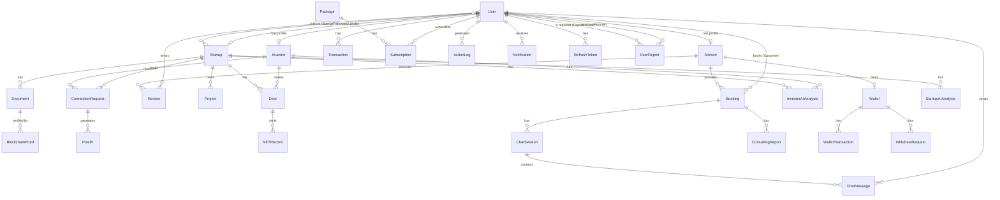

# 3.1.5 Entity Relationship Diagram

---

## Entities Description

| # | Entity | Description |
|---|--------|-------------|
| 1 | **User** | Represents all accounts in the system. Inherits from ASP.NET Identity and includes role (Startup, Investor, Advisor, Admin), verification status, and date of birth. |
| 2 | **Startup** | Profile of a startup company registered on the platform. Contains company information (name, industry, stage, financials, team) linked one-to-one with a User. |
| 3 | **Investor** | Profile of an investor on the platform. Contains investment preferences (industry, stage, risk tolerance, region, budget) linked one-to-one with a User. |
| 4 | **Advisor** | Profile of a consulting advisor available for booking. Contains expertise, certifications, experience, rating, and languages spoken, linked one-to-one with a User. |
| 5 | **Project** | An investment project created by a Startup. Has a name, description, and status. Can hold multiple documents, AI analyses, and deals. |
| 6 | **Document** | A file uploaded and associated with a Project (e.g., pitch deck, financial report). Tracks document type, file URL, hash, blockchain tx hash, and IP protection flag. |
| 7 | **StartupAIAnalysis** | An AI-generated evaluation report for a startup's Project. Stores potential score, chaos score, and detailed JSON analysis results. |
| 8 | **InvestorAIAnalysis** | An AI-generated compatibility analysis matching an Investor's profile against a specific Project. Stores JSON analysis results. |
| 9 | **ConnectionRequest** | A formal connection request sent by an Investor to a Startup. Tracks status (Pending/Accepted/Rejected), messages, and response details. |
| 10 | **Deal** | An investment deal agreed between an Investor and a startup's Project. Records amount, equity percentage, payment method, confirmation from both parties, and blockchain tx hash. |
| 11 | **NFTRecord** | An NFT token minted on the blockchain to represent and certify a completed Deal. Stores token ID, owner wallet, tx hash, and validity/transferability status. |
| 12 | **Booking** | A consulting session booking made by a User (customer) with an Advisor. Records scheduled time, price, and booking status. |
| 13 | **ChatSession** | A live chat session opened within a Booking between an Advisor and a Customer. Tracks open/closed state and session duration. |
| 14 | **ChatMessage** | An individual message sent by a User within a ChatSession. Records content, sender, and timestamp. |
| 15 | **ConsultingReport** | A formal meeting report generated after a Booking session. Records meeting title, purpose, content, decisions made, and location. |
| 16 | **Review** | A rating and written review submitted by a User for an Advisor after a consulting session. |
| 17 | **Wallet** | A digital wallet belonging to a User for managing funds on the platform. Tracks balance, currency, and active status. |
| 18 | **Transaction** | A platform-level financial transaction record linked to a User. Tracks amount, type, status, and transaction date. |
| 19 | **WalletTransaction** | A specific fund movement record within a Wallet (deposit, payment, withdrawal). Tracks amount, type, and status. |
| 20 | **WithdrawRequest** | A User's request to withdraw funds from their Wallet. Tracks requested amount and approval/rejection status. |
| 21 | **Package** | A service subscription package offered by the platform, with a defined name, description, price, and duration in days. |
| 22 | **Subscription** | Records a User's active subscription to a Package. Tracks start date, end date, and subscription status. |
| 23 | **ActionLog** | An audit trail entry recording an action performed by a User in the system. Captures action type, affected entity type and ID, and timestamp. |
| 24 | **Post** | A public announcement or deal post generated from an approved ConnectionRequest. Requires approval from both Startup and Investor before publishing. |
| 25 | **Notification** | An in-app notification delivered to a User. Tracks message content, read/unread status, and creation timestamp. |
| 26 | **BlockchainProof** | A blockchain verification proof record linked to a Document. Stores the on-chain transaction hash, verification status, and timestamp. |
| 27 | **RefreshToken** | A JWT refresh token issued to a User for maintaining login sessions. Supports rotation, revocation tracking, and IP recording. |
| 28 | **StartupFollower** | A many-to-many join entity recording which Users are following which Startups. Records the timestamp of when the follow action occurred. |
| 29 | **UserReport** | A report filed by one User (Reporter) against another User (ReportedUser) for misconduct. Tracks reason, evidence URL, and review status. |
